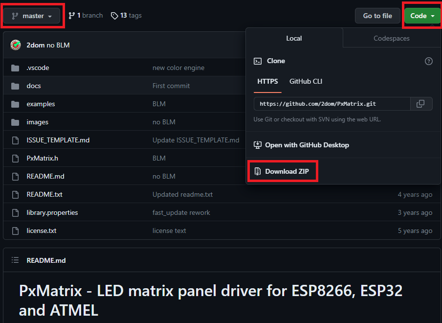
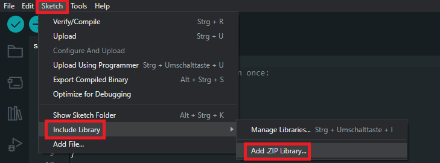
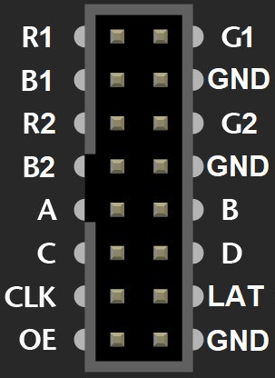
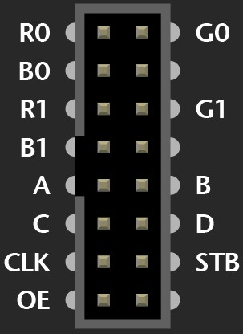
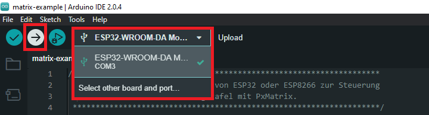

# Citylab Berlin Summer School 2023
## Matrix Example - Text und Bild auf der Anzeigetafel anzeigen

### Inhalte
- [Getting Started](#getting-started)
- [Verkabeln](#verkabeln)
- [Upload Code](#upload-code)
- [Programmieranleitung](#programmieranleitung)

### Getting Started
- Arduino IDE 2.0 installieren
    
    [Arduino Software](https://www.arduino.cc/en/software)
    
- ESP32 und ESP8266 libs in Arduino IDE installieren
    
    [ESP32 installieren](https://www.azdelivery.de/blogs/azdelivery-blog-fur-arduino-und-raspberry-pi/esp32-jetzt-mit-boardverwalter-installieren)
    
    [ESP8266 installieren](https://arduino-esp8266.readthedocs.io/en/latest/installing.html)
    
- PxMatrix Bibliothek in Arduino IDE einbinden
    
    [PxMatrix](https://github.com/2dom/PxMatrix) - An dieser Stelle danke an Dominic Buchstaller `@2dom` für die wundervolle Bibliothek.
    
    - master Branch als .zip herunterladen
        
        
        
    - .zip Bibliothek in Arduino IDE einbinden
        
        
        
        Danach wählen Sie bitte die heruntergeladene .zip Datei aus.
        
### Verkabeln
    
- Skizze der Verkabelung zwischen P5-16S-64x32 und ESP32:
    
    

- zwischen HUB75 LED-Matrixanzeigetafel und ESP:
                
    - Falls auf dem Panel Input R1 oben links ist
        
        
        
        | PI | PO |
        | --- | --- |
        | R2 | R1 |
        | G1 | R2 |
        | G2 | G1 |
        | B1 | G2 |
        | B2 | B1 |
        
        | PI | ESP32 GPIO | ESP8266 GPIO |
        | --- | --- | --- |
        | R1 | 13 - D13 | 13 - D7 |
        | A | 19 - D19  | 05 - D1 |
        | B | 23 - D23 | 04 - D2 |
        | C (8S, 16S, 32S) | 18 - D18 | 15 - D8 |
        | D (16S, 32S) | 05 - D5 | 23 - D6 |
        | E (nur 32S) | 15 - D15 | 00 - D3 |
        | CLK | 14 - D14 | 14 - D5 |
        | STB/LAT | 22 - D22 | 16 - D0 |
        | OE | 16 - RX2 | 02 - D4 |
        | GND | GND | GND |
        
    - Falls auf dem Panel Input R0 oben links ist
        
        
        
        | PI | PO |
        | --- | --- |
        | R1 | R0 |
        | G0 | R1 |
        | G1 | G0 |
        | B0 | G1 |
        | B1 | B0 |
        
        | PI | ESP32 GPIO | ESP8266 GPIO |
        | --- | --- | --- |
        | R0 | 13 - D13 | 13 - D7 |
        | A | 19 - D19  | 05 - D1 |
        | B | 23 - D23 | 04 - D2 |
        | C (8S, 16S, 32S) | 18 - D18 | 15 - D8 |
        | D (16S, 32S) | 05 - D5 | 12 - D6 |
        | E (nur 32S) | 15 - D15 | 00 - D3 |
        | CLK | 14 - D14 | 14 - D5 |
        | STB/LAT | 22 - D22 | 16 - D0 |
        | OE | 16 - RX2 | 02 - D4 |
        | GND | GND | GND |

    **Anmerkung**: Pins C, D und E werden nur je nach der Abtastrate der Anzeige benötigt (siehe Tabelle oben). Diese Abtastrate finden Sie auf der Rückseite der Anzeige. Aber, es gibt einige 16S Anzeigen, bei der der E Pin angeschlossen werden muss, da ansonsten Lücken in der Anzeige entstehen können. Sie können überprüfen, ob der Pin angeschlossen werden muss, indem Sie der E Pin gegen `GND` messen. Falls der Pin mit `GND` verbunden ist, dann brauchen Sie diesen Pin nicht anschließen.

- ESP an PC über USB Kabel verbinden
- HUB75 LED-Matrixanzeige an Stromversorgung anschließen (nicht in der Skizze dargestellt)
      
### Upload Code
    
Laden Sie den `main` Branch dieses Repositorys als .zip herunter und entpacken Sie die Datei in Ihren Arbeitsordner. Danach machen Sie die `matrix_example.ino` Datei mit Arduino IDE auf. Wählen Sie dann das richtige Board (für ESP32 ESP32-WROOM-DA Module oder für ESP8266 NodeMCU 1.0 (ESP-12E Module)) sowie den richtigen Port aus und klicken Sie auf Upload. 
    


Das Ergebnis soll dann so aussehen, falls nicht, müssen einige Anpassungen an Einstellungen im Setup (mux pattern, scan pattern etc.) vorgenommen werden.
    
https://github.com/rasafitri/matrix-example/assets/129408886/c0aa9d4f-b9c9-4493-9465-fb5feca5b507

### Programmieranleitung
- TLDR:
   ```
   //Auf dem Bildschirm können sowohl Text als auch ein Bild angezeigt werden.
   //Es gibt drei verschiedene Möglichkeiten: scrollText, drawText und drawImage
   void loop() {
     scrollText("Herzlich Willkommen zur Summer School 2023!", myBLUE);  // Willkommenstext (laufend) in blau
     delay(500);                                                         // kurze Pause
     drawText("Bald kommt Youtube Logo!", myGREEN);                      // Text (stehend) in grün
     delay(2000);                                                        // 2s Pause
     drawImage(youtube_logo, imageWidth, imageHeight);                   // Youtube Logo als Bild
     delay(5000);                                                        // 5s Pause
   }
        
   scrollText("gewünschtes Text", dieFarbe) // für einen laufenden Text
                                            // 2 Argumente: der Text als String und die gewünschte Farbe für den Text.
        
   drawText("Bald kommt Youtube Logo!", myGREEN); // für einen stehenden Text
                                                  // Argumente wie "scrollText"
        
    drawImage(youtube_logo, imageWidth, imageHeight); // für ein Bild
                                                      // imageWidth, imageHeight: Bildgröße
    ```

- Hinzufügen der erforderlichen Bibliothek
   ```
   // Lib für die Steuerung der Anzeigetafel
   #include <PxMatrix.h>
   ```
        
- Alle Pins und Konstante definieren, die benötigt sind. Vergessen Sie nicht, bei Bedarf einige Werte anzupassen.
  ```
  // ----------------------------------------
  // Einstellungen der LED-Matrixanzeigetafel
  // ----------------------------------------
  #define matrix_width 64   // Breite der Anzeige, anzupassen
  #define matrix_height 32  // Höhe der Anzeige, anzupassen
        
  // Pin Belegungen der Anzeige, anzupassen
  #ifdef ESP32
  #define P_A 19
  #define P_B 23
  #define P_C 18
  #define P_D 5
  #define P_E -1  // anzupassen bei Verbindung
  #define P_LAT 22
  #define P_OE 16
  #endif
        
  #ifdef ESP8266
  #define P_A 5
  #define P_B 4
  #define P_C 15
  #define P_D 12
  #define P_E -1  // anzupassen bei Verbindung
  #define P_LAT 16
  #define P_OE 2
  #endif
        
  PxMATRIX display(matrix_width, matrix_height, P_LAT, P_OE, P_A, P_B, P_C, P_D, P_E);
        
  // die Helligkeit der Anzeige, 30-70, je nach Bedarf anpassen
  uint8_t display_draw_time = 60;
        
  // ----------------------------------------
  // Timer für Callbacks
  // ----------------------------------------
  #ifdef ESP32
  hw_timer_t* timer = NULL;
  portMUX_TYPE timerMux = portMUX_INITIALIZER_UNLOCKED;
  #endif
  #ifdef ESP8266
  #include <Ticker.h>
  Ticker display_ticker;
  #endif
  ```
        
- Vordefinierte Farben in RGB für das Text definieren
  ```
  // ----------------------------------------
  // Standard-Farben in RGB565 für Texte
  // ----------------------------------------
  uint16_t myRED = display.color565(255, 0, 0);
  uint16_t myGREEN = display.color565(0, 255, 0);
  uint16_t myBLUE = display.color565(0, 0, 255);
  uint16_t myWHITE = display.color565(255, 255, 255);
  uint16_t myYELLOW = display.color565(255, 255, 0);
  uint16_t myCYAN = display.color565(0, 255, 255);
  uint16_t myMAGENTA = display.color565(255, 0, 255);
  uint16_t myBLACK = display.color565(0, 0, 0);
  ```
        
- Bild definieren. [Das Bild mit dem Youtube Logo](/images/yt-logo.png) wird hier als Beispiel verwendet. Das Bild wurde in .c Datei mit diesem ImageConverter (UTFT) umgewandelt. Sie können auch ein anderes Bild verwenden. Achten Sie bitte darauf, dass das Bild kleiner oder genau so groß ist als/wie Ihre Anzeige, damit das Bild nicht abgeschnitten wird. Danach wählen Sie `Convert to .c file` aus und klicken Sie auf `Make File`. Die Datei wird dann automatisch heruntergeladen. Öffnen Sie die Datei und kopieren Sie die Hex Werte und fügen Sie diese in Ihren Code ein.
   ```
   // ----------------------------------------
   // Beispielbild
   // ----------------------------------------
   // ./images/yt-logo.png umgewandelt in .c Datei mit ImageConverter (UTFT) von http://www.rinkydinkelectronics.com/t_imageconverter565.php
   uint16_t static youtube_logo[] = {
       0x2800, 0x0000, 0xF800, 0xF800, 0xF800, 0xF800, 0xF800, 0xF800, 0xF800, 0xF800, 0xF800, 0xF800, 0xF800, 0xF800, 0xF800, 0xF800,  // 0x0010 (16) pixels
       0xF800, 0xF800, 0xF800, 0x0000, 0x2800, 0x0000, 0xF800, 0xF800, 0xF800, 0xF800, 0xF800, 0xF800, 0xF800, 0xF800, 0xF800, 0xF800,  // 0x0020 (32) pixels
       0xF800, 0xF800, 0xF800, 0xF800, 0xF800, 0xF800, 0xF800, 0xF800, 0xF800, 0x0000, 0xF800, 0xF800, 0xF800, 0xF800, 0xF800, 0xF800,  // 0x0030 (48) pixels
       0xF800, 0xF800, 0xFFFF, 0xF800, 0xF800, 0xF800, 0xF800, 0xF800, 0xF800, 0xF800, 0xF800, 0xF800, 0xF800, 0xF800, 0xF800, 0xF800,  // 0x0040 (64) pixels
       0xF800, 0xF800, 0xF800, 0xF800, 0xF800, 0xF800, 0xF800, 0xFFFF, 0xFFFF, 0xF800, 0xF800, 0xF800, 0xF800, 0xF800, 0xF800, 0xF800,  // 0x0050 (80) pixels
       0xF800, 0xF800, 0xF800, 0xF800, 0xF800, 0xF800, 0xF800, 0xF800, 0xF800, 0xF800, 0xF800, 0xF800, 0xFFFF, 0xFFFF, 0xFFFF, 0xF800,  // 0x0060 (96) pixels
       0xF800, 0xF800, 0xF800, 0xF800, 0xF800, 0xF800, 0xF800, 0xF800, 0xF800, 0xF800, 0xF800, 0xF800, 0xF800, 0xF800, 0xF800, 0xF800,  // 0x0070 (112) pixels
       0xF800, 0xFFFF, 0xFFFF, 0xFFFF, 0xFFFF, 0xF800, 0xF800, 0xF800, 0xF800, 0xF800, 0xF800, 0xF800, 0xF800, 0xF800, 0xF800, 0xF800,  // 0x0080 (128) pixels
       0xF800, 0xF800, 0xF800, 0xF800, 0xF800, 0xF800, 0xFFFF, 0xFFFF, 0xFFFF, 0xFFFF, 0xFFFF, 0xF800, 0xF800, 0xF800, 0xF800, 0xF800,  // 0x0090 (144) pixels
       0xF800, 0xF800, 0xF800, 0xF800, 0xF800, 0xF800, 0xF800, 0xF800, 0xF800, 0xF800, 0xF800, 0xFFFF, 0xFFFF, 0xFFFF, 0xFFFF, 0xFFFF,  // 0x00A0 (160) pixels
       0xFFFF, 0xF800, 0xF800, 0xF800, 0xF800, 0xF800, 0xF800, 0xF800, 0xF800, 0xF800, 0xF800, 0xF800, 0xF800, 0xF800, 0xF800, 0xF800,  // 0x00B0 (176) pixels
       0xFFFF, 0xFFFF, 0xFFFF, 0xFFFF, 0xFFFF, 0x0000, 0xF800, 0xF800, 0xF800, 0xF800, 0xF800, 0xF800, 0xF800, 0xF800, 0xF800, 0xF800,  // 0x00C0 (192) pixels
       0xF800, 0xF800, 0xF800, 0xF800, 0xF800, 0xFFFF, 0xFFFF, 0xFFFF, 0xFFFF, 0x0000, 0xF800, 0xF800, 0xF800, 0xF800, 0xF800, 0xF800,  // 0x00D0 (208) pixels
       0xF800, 0xF800, 0xF800, 0xF800, 0xF800, 0xF800, 0xF800, 0xF800, 0xF800, 0xF800, 0xFFFF, 0xFFFF, 0xFFFF, 0x0000, 0xF800, 0xF800,  // 0x00E0 (224) pixels
       0xF800, 0xF800, 0xF800, 0xF800, 0xF800, 0xF800, 0xF800, 0xF800, 0xF800, 0xF800, 0xF800, 0xF800, 0xF800, 0xF800, 0xF800, 0xFFFF,  // 0x00F0 (240) pixels
       0xFFFF, 0x0000, 0xF800, 0xF800, 0xF800, 0xF800, 0xF800, 0xF800, 0xF800, 0xF800, 0xF800, 0xF800, 0xF800, 0xF800, 0xF800, 0xF800,  // 0x0100 (256) pixels
       0xF800, 0xF800, 0xF800, 0xF800, 0xFFFF, 0x0000, 0xF800, 0xF800, 0xF800, 0xF800, 0xF800, 0xF800, 0xF800, 0xF800, 0xF800, 0xF800,  // 0x0110 (272) pixels
       0xF800, 0xF800, 0xF800, 0xF800, 0xF800, 0xF800, 0xF800, 0xF800, 0xF800, 0x0000, 0xF800, 0xF800, 0xF800, 0xF800, 0xF800, 0xF800,  // 0x0120 (288) pixels
       0xF800, 0xF800, 0xF800, 0xF800, 0xF800, 0xF800, 0x0000, 0xF800, 0xF800, 0xF800, 0xF800, 0xF800, 0xF800, 0xF800, 0xF800, 0xF800,  // 0x0130 (304) pixels
       0xF800, 0xF800, 0xF800, 0xF800, 0xF800, 0xF800, 0xF800, 0xF800, 0xF800, 0xF800, 0x0000, 0x2800, 0x0000, 0xF800, 0xF800, 0xF800,  // 0x0140 (320) pixels
       0xF800, 0xF800, 0xF800, 0xF800, 0xF800, 0xF800, 0xF800, 0xF800, 0xF800, 0xF800, 0xF800, 0xF800, 0xF800, 0xF800, 0x0000, 0x2800,  // 0x0150 (336) pixels
   };
   ```
        
- Bildgröße definieren (finden Sie unter `Eigenschaften/Details`)
  ```
  // Größe des Bilds in px
  int imageWidth = 21;
  int imageHeight = 16;
  ```
        
- Funktionen für Anzeige Update hinzufügen, genau so wie das Beispiel der PxMatrix Bibliothek
  ```
   // ----------------------------------------
   // Funktionen für Anzeige Update
   // ----------------------------------------
   #ifdef ESP32
   void IRAM_ATTR display_updater() {
      portENTER_CRITICAL_ISR(&timerMux);
      display.display(display_draw_time);
      portEXIT_CRITICAL_ISR(&timerMux);
   }
   #endif
   #ifdef ESP8266
   void display_updater() {
      display.display(display_draw_time);
   }
   #endif
        
   void display_update_enable(bool is_enable) {
       #ifdef ESP32
       if (is_enable) {
           timer = timerBegin(0, 80, true);
           timerAttachInterrupt(timer, &display_updater, true);
           timerAlarmWrite(timer, 4000, true);
           timerAlarmEnable(timer);
       } else {
           timerDetachInterrupt(timer);
           timerAlarmDisable(timer);
       }
       #endif
       #ifdef ESP8266
       if (is_enable)
           display_ticker.attach(0.004, display_updater);
       else
           display_ticker.detach();
       #endif
   }
   ```
        
- Funktionen für die Anzeige definieren. Es gibt hier drei Optionen: `scrollText`, `drawText` und `drawImage`.
  - `scrollText:` um einen laufenden Text zu zeigen. Die Funktion braucht zwei Argumente: der anzuzeigende Text und die Farbe des Texts.
  - `drawText:` um einen stehenden Text zu zeigen. Auch diese Funktion braucht die selben zwei Argumente: der anzuzeigende Text und die Farbe des Texts.
  - `drawImage:` um ein Bild anzuzeigen. Diese Funktion braucht drei Argumente: die Hex Werte des Bildes als ein Array, die Breite und die Höhe des Bildes (`imageWidth` und `imageHeight`).
  ```
  // ----------------------------------------
  // LED-Matrixanzeige Funktionen
  // ----------------------------------------
  // zeige einmalig einen Lauftext in bestimmter Farbe
  void scrollText(String text, uint16_t colorRGB) {
      unsigned long scroll_speed = 50;       // Geschwindigkeit des Scrollens
      uint16_t text_length = text.length();  // Länge des Texts für die Berechnung
        
      // Einstellung der Display
      display.setTextWrap(false);      // Lauftext --> kein TextWrap nötig
      display.setTextSize(1);          // Standardgröße, 8px
      display.setRotation(0);          // keine Rotation
      display.setTextColor(colorRGB);  // Farbe des Texts wie angegeben
        
      // Schritt für Schritt Text Anzeigen
      for (int xpos = matrix_width; xpos > -(matrix_width + text_length * 5); xpos--) {
            display.clearDisplay();      // immer Anzeige zurücksetzen, bevor etwas Neues angezeigt wird
            display.setCursor(xpos, 0);  // Setze den Text ganz oben (ypos=0), aber bei variablen xpos
            display.println(text);
            delay(scroll_speed);
            yield();
        
            delay(scroll_speed / 5);
            yield();
      }
   }
        
   // zeige den stehenden Text in bestimmter Farbe
   void drawText(String text, uint16_t colorRGB) {
       display.clearDisplay();          // immer Anzeige zurücksetzen, bevor etwas Neues angezeigt wird
       display.setTextWrap(true);       // stehender Text --> TextWrap nötig für längere Texte
       display.setTextSize(1);          // Standardgröße, 8px
       display.setRotation(0);          // keine Rotation
       display.setCursor(0, 0);         // Text fängt bei der Position oben links
       display.setTextColor(colorRGB);  // Farbe des Texts wie angegeben
       display.println(text);
    }
        
    // zeige das skalierte Bild
    void drawImage(uint16_t image[], int imageWidth, int imageHeight) {
        display.clearDisplay();  // immer Anzeige zurücksetzen, bevor etwas Neues angezeigt wird
        int counter = 0;
        for (int y = 0; y < imageHeight; y++) {
          for (int x = 0; x < imageWidth; x++) {
             display.drawPixel(x, y, image[counter]);
             counter++;
          }
        }
     }
     ```
        
- Setup des Mikrocontrollers, achten Sie bitte dabei, dass bei bestimmten Anzeigen ggf. mehr Einstellungen benötigt sind.
  ```
  // ----------------------------------------
  // Setup
  // ----------------------------------------
  void setup() {
     Serial.begin(115200);  // Serial baudrate 115200
        
     // LED-Matrixanzeige einstellen
     display.begin(16);  // display rows-scan pattern 1/16
     display.setFastUpdate(true);
        
     // ----------------------------------------
     // weitere Einstellungen laut PxMatrix Example
     // anzupassen wenn Grundeinstellungen nicht ausreichend sind
     // Für weitere Infos siehe https://github.com/2dom/PxMatrix/tree/master
     // ----------------------------------------
        
     // multiplex pattern {BINARY (def), STRAIGHT, SHIFTREG_ABC, SHIFTREG_SPI_SE}
     //display.setMuxPattern(BINARY);
        
     // scan pattern {LINE (def), ZIGZAG,ZZAGG, ZAGGIZ, WZAGZIG, VZAG, ZAGZIG, WZAGZIG2}
     //display.setScanPattern(LINE);
        
     // Rotate display
     //display.setRotate(true);
        
     // Flip display
     //display.setFlip(true);
        
     // minimum color values that result in an active pixel
     //display.setColorOffset(5, 5,5);
        
     // color order {RRGGBB (def), RRBBGG, GGRRBB, GGBBRR, BBRRGG, BBGGRR}
     //display.setColorOrder(RRGGBB);
        
     // time in microseconds that we pause after selecting each mux channel
     // (May help if some rows are missing / the mux chip is too slow)
     //display.setMuxDelay(0,1,0,0,0);
        
     // Set the number of panels that make up the display area width (default is 1)
     //display.setPanelsWidth(2);
        
     // Set the brightness of the panels (default is 255)
     //display.setBrightness(50);
        
     // Set driver chip type
     //display.setDriverChip(FM6124);
        
     display.clearDisplay();  // immer Anzeige zurücksetzen, bevor etwas Neues angezeigt wird
     display_update_enable(true);
   }
   ```
        
- Loop des Mikrocontrollers
  ```
  void loop() {
     scrollText("Herzlich Willkommen zur Summer School 2023!", myBLUE);  // Willkommenstext (laufend) in blau
     delay(500);                                                         // kurze Pause
     drawText("Bald kommt Youtube Logo!", myGREEN);                      // Text (stehend) in grün
     delay(2000);                                                        // 2s Pause
     drawImage(youtube_logo, imageWidth, imageHeight);                   // Youtube Logo als Bild
     delay(5000);                                                        // 5s Pause
  }
  ```
