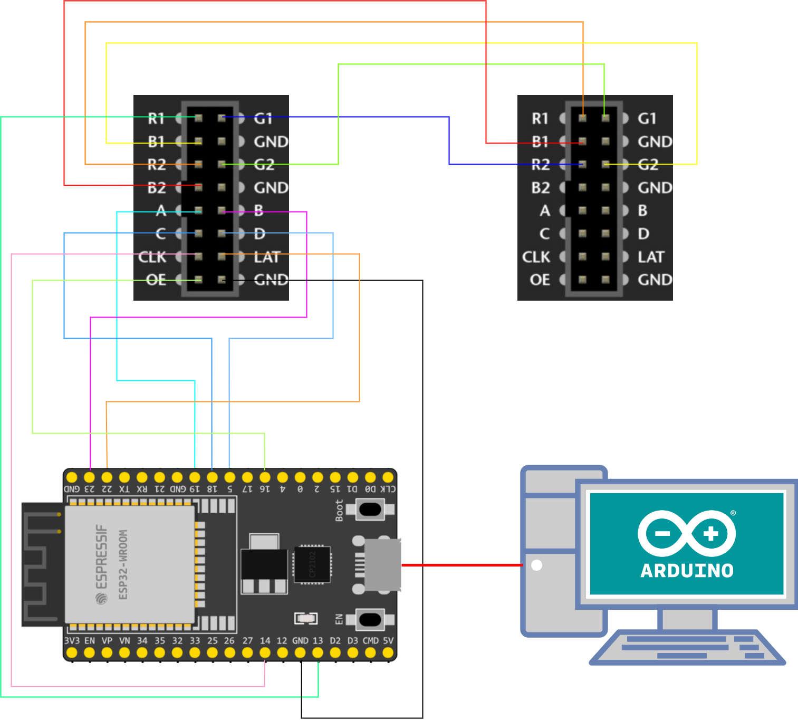

# Matrix Example - Text und Bild auf der Anzeigetafel anzeigen

- Arduino IDE 2.0 installieren
    
    [Arduino Software](https://www.arduino.cc/en/software)
    
- ESP32 und ESP8266 libs installieren
    
    [ESP32 installieren](https://www.azdelivery.de/blogs/azdelivery-blog-fur-arduino-und-raspberry-pi/esp32-jetzt-mit-boardverwalter-installieren)
    
    [ESP8266 installieren](https://arduino-esp8266.readthedocs.io/en/latest/installing.html)
    
- PxMatrix Bibliothek einbinden
    
    [PxMatrix](https://github.com/2dom/PxMatrix) - An dieser Stelle danke an Dominic Buchstaller für die wundervolle Bibliothek.
    
    - master Branch als .zip herunterladen
        
        
        
    - .zip Bibliothek in Arduino IDE einbinden
        
        
        
        Danach wählen Sie bitte die heruntergeladene .zip Datei aus.
        
- Verkabeln
    
    Skizze der Verkabelung zwischen P5-16S-64x32 und ESP32
    
    
    
    - zwischen HUB75 LED-Matrixanzeigetafel und ESP
        
        
        Falls auf dem Panel Input R1 oben links ist
        
        
        
        | PI | PO |
        | --- | --- |
        | R2 | R1 |
        | G1 | R2 |
        | G2 | G1 |
        | B1 | G2 |
        | B2 | B1 |
        
        | PI | ESP32 GPIO | ESP8266 GPIO |
        | --- | --- | --- |
        | R1 | 13 - D13 | 13 - D7 |
        | A | 19 - D19  | 05 - D1 |
        | B | 23 - D23 | 04 - D2 |
        | C | 18 - D18 | 15 - D8 |
        | D | 05 - D5 | 23 - D6 |
        | E (nur 32S) | 15 - D15 | 00 - D3 |
        | CLK | 14 - D14 | 14 - D5 |
        | STB/LAT | 22 - D22 | 16 - D0 |
        | OE | 16 - RX2 | 02 - D4 |
        | GND | GND | GND |
        
        Falls auf dem Panel Input R0 oben links ist
        
        
        
        | PI | PO |
        | --- | --- |
        | R1 | R0 |
        | G0 | R1 |
        | G1 | G0 |
        | B0 | G1 |
        | B1 | B0 |
        
        | PI | ESP32 GPIO | ESP8266 GPIO |
        | --- | --- | --- |
        | R0 | 13 - D13 | 13 - D7 |
        | A | 19 - D19  | 05 - D1 |
        | B | 23 - D23 | 04 - D2 |
        | C | 18 - D18 | 15 - D8 |
        | D | 05 - D5 | 12 - D6 |
        | E (nur 32S) | 15 - D15 | 00 - D3 |
        | CLK | 14 - D14 | 14 - D5 |
        | STB/LAT | 22 - D22 | 16 - D0 |
        | OE | 16 - RX2 | 02 - D4 |
        | GND | GND | GND |
    - ESP an PC über USB Kabel verbinden
    - HUB75 LED-Matrixanzeige an Stromversorgung anschließen (nicht in der Skizze dargestellt)
- Upload Code
    
    Laden Sie den main Branch dieses Repository als .zip herunter und entpacken Sie die Datei in Ihren Arbeitsordner. Danach machen Sie die matrix_example.ino Datei mit Arduino IDE auf. Wählen Sie dann das richtige Board (für ESP32 ESP32-WROOM-DA Module oder für ESP8266 NodeMCU 1.0 (ESP-12E Module)) sowie den richtigen Port aus und klicken Sie auf Upload. 
    
    

    Das Ergebnis soll dann so aussehen, falls nicht, müssen einige Anpassungen an Einstellungen im Setup (mux pattern, scan pattern etc.) vorgenommen werden.
    
    